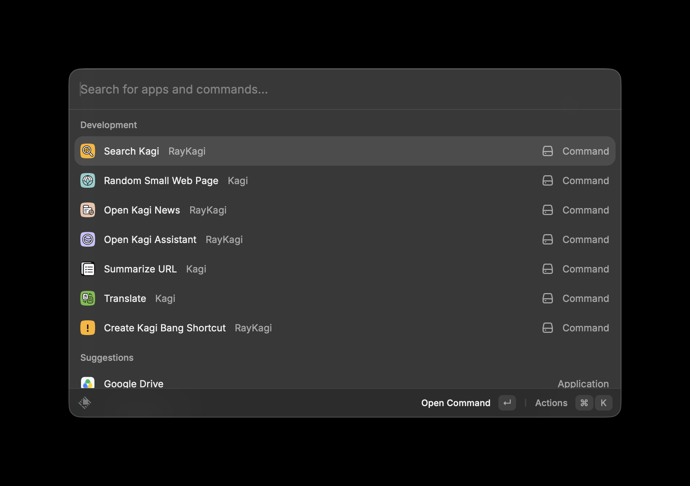

# RayKagi

[Kagi](https://kagi.com) from your [Raycast](https://raycast.com) launcher: search Kagi **in-app** (with an API key) and jump straight into Kagi Translate, Summarizer, News, Small Web, Assistant and bangs.

> [!NOTE]
> **Unofficial.** RayKagi is a community project — not affiliated with, endorsed by, or sponsored by Kagi Inc. "Kagi" and the Kagi logos are trademarks of Kagi Inc., used here only to identify the services this extension integrates with.

> [!NOTE]
> **Fully vibecoded.** This project was built end-to-end by **Claude Opus 4.8** (Anthropic) through conversational prompting — design, code, icons, and docs. Review accordingly.

The extension is **fully usable without an API token**. Only **Search** calls Kagi's paid API (and shows results inside Raycast); everything else opens a Kagi web page in your browser.

## Install

- **Raycast Store:** [raycast.com/Shabablinchikow/raykagi](https://www.raycast.com/Shabablinchikow/raykagi) — or open `raycast://extensions/Shabablinchikow/raykagi` _(available once the extension is published)._
- **From source:** see [Development](#development) below, or [CONTRIBUTING.md](CONTRIBUTING.md).

## Screenshots



## Commands

| Command | Needs token? | What it does |
| --- | --- | --- |
| **Search Kagi** | optional | Free autocomplete as you type. **↩** runs a search (billed); **⌘⇧R** researches the query with the `!research` bang. No token → **↩** opens the query in your browser. |
| **Create Kagi Bang Shortcut** | no | Pick a `!bang` (or type any custom trigger like `!research`) and create a Quicklink shortcut for it — then give it an alias/hotkey in Raycast. |
| **Translate** | no | Type text → **↩** translates to your default language (English) in one step. **⌘N** saves a language pair as an in-extension preset; **⌘B** on a saved pair makes a Quicklink for an alias/hotkey. |
| **Summarize URL** | no | Open the Kagi Universal Summarizer for a URL (summary or key takeaways); **⌘B** to bind. |
| **Open Kagi News** | no | Opens Kagi News (`news.kagi.com`) in your browser. |
| **Random Small Web Page** | no | Opens a random page from the Kagi Small Web each time. |
| **Open Kagi Assistant** | no | Opens the Kagi Assistant in your browser. |

> Quick Answer was removed for now — Kagi's AI Quick Answer has no API. It'll return inside **Search** once an API exists to fetch it. (Today, ⌘⇧R / the `!research` bang gives a deeper browser answer.)

## Minimal billing

Only the **Search** command calls the paid Kagi v1 Search API (≈ $0.012/query). To avoid surprise charges:

- Typing only triggers the **free** autosuggest endpoint.
- The paid search fires **once, on Enter** — never per keystroke (autosuggest is debounced too).

## Binding bangs / translate to an alias or hotkey

Raycast can't assign hotkeys to individual list rows, so this uses Raycast's native **Quicklinks**:

1. Open **Create Kagi Bang Shortcut** (pick a bang), or **Translate** then **⌘B** (pick a From/To/Quality pair).
2. Run **Create Quicklink / Bind**.
3. In the Create Quicklink form, set an **alias** (e.g. `kgg`, `te`) or a **hotkey** (e.g. `⌘⌥K`).

The Quicklink uses the `{Query}` placeholder, so `kgg <text>` searches with that bang, `te <text>` translates, etc. Each bind makes one Quicklink, so you can build as many language pairs / bangs as you want (one alias each). The **Custom bang** row lets you bind triggers that aren't in the catalog (e.g. `!research`).

## API token

Only needed for the **Search** command. Generate one at [kagi.com/api/keys](https://kagi.com/api/keys) and paste it into the extension preferences (stored as a password). All other commands work without it.

## Development

```sh
npm install
npm run dev      # ray develop — loads into Raycast with hot reload
npm run build    # ray build
npm run lint     # ray lint
node scripts/check-urls.mjs   # URL-builder self-check
```

See [CONTRIBUTING.md](CONTRIBUTING.md) for the full workflow and project layout.

## Contributing

Issues and PRs welcome — please read [CONTRIBUTING.md](CONTRIBUTING.md) first.

## License

[MIT](LICENSE) © 2026 Shabablinchikow.

The Kagi name and the product logos in `assets/` (everything except `bang.*`) are trademarks/assets of **Kagi Inc.**, are **not** covered by the MIT license, and are included only to identify the Kagi services this unofficial extension integrates with.

## Links

- Raycast Store listing: [raycast.com/Shabablinchikow/raykagi](https://www.raycast.com/Shabablinchikow/raykagi) _(once published)_
- Source: [github.com/Shabablinchikow/RayKagi](https://github.com/Shabablinchikow/RayKagi)
- Kagi: [kagi.com](https://kagi.com) · API docs: [help.kagi.com/kagi/api](https://help.kagi.com/kagi/api/)
